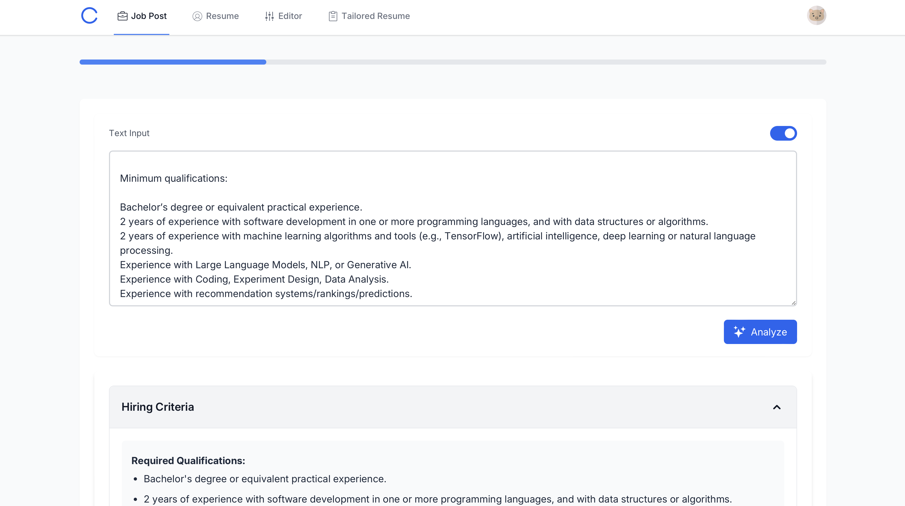
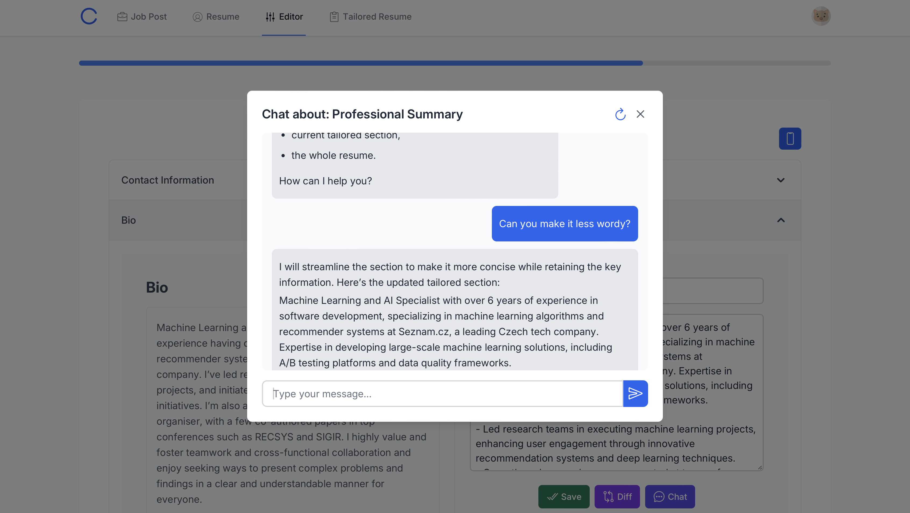
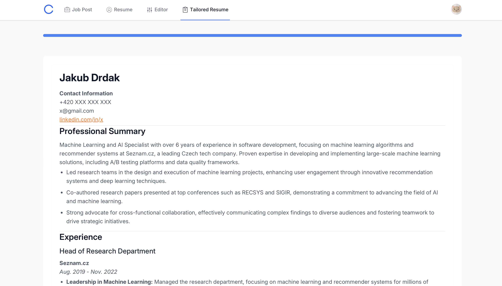
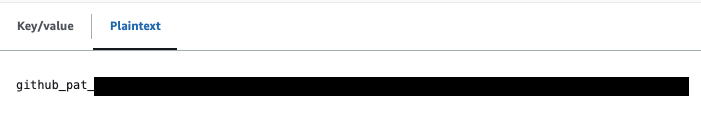
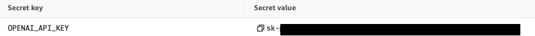

# AI-Powered Resume Tailoring Application

Welcome to the AI-Powered Resume Tailoring Application repository. This application leverages the power of OpenAI, AWS Lambda, AWS Secrets Manager, and AWS Amplify to provide a scalable and secure solution for tailoring resumes to specific job posts.

## Features

1. **Job Post Analysis**: Paste a job post, and the application will extract the key hiring criteria.
2. **Resume Parsing**: Paste a resume, and the application will parse it into semantic sections.
3. **Tailored Sections**: Each section of the resume is tailored based on the extracted hiring criteria.
4. **Interactive Editing**: Use the editor page to either manually modify the resume sections or chat with the AI model to further enhance them.
5. **Final Resume Generation**: After tailoring the sections, the application generates a final, tailored resume.

## Technologies Used

- **OpenAI**: For natural language processing and AI-driven insights.
- **LangChain**: For building and managing complex AI workflows.
- **AWS Lambda**: For serverless computing.
- **AWS Secrets Manager**: For secure management of sensitive information.
- **AWS Amplify**: For seamless deployment and hosting.

[](./TMYS1.png)
[](./TMYS2.png)
[](./TMYS3.png)
[](./TMYS4.png)


## Table of Contents

- [Prerequisites](#prerequisites)
- [Development](#development)
- [Configuration](#configuration)
- [Deployment](#deployment)
- [License](#license)

## Prerequisites

- Python 3.11 or higher
- Docker
- OpenAI API key
- AWS CLI configured with appropriate permissions
- AWS SAM CLI (for local development and deployment)
- Node.js and npm (for frontend development)


## Development

### Backend

You can test the Lambda function locally using the AWS SAM CLI.

1.  Fork and clone the repository:

    ```bash
    git clone https://github.com/[your-repo]/tell-me-your-story.git
    cd tell-me-your-story/backend
    ```

2. Start the local API:

    ```bash
    sam local start-api
    ```

3. Build the application:

    ```bash
    sam build --use-container
    ```

3. Create a file `backend/.env.json` and add your OpenAI key:

    *backend/.env.json*
    ```
    {
        "Parameters": {
            "OPENAI_API_KEY": your OpenAI API key,
            "SESSIONTABLE_TABLE_NAME": "SessionTable",
            "USERTABLE_TABLE_NAME": "UserTable"
        }
    }
    ```
4. Invoke the functions locally:

    ```bash
    sam local invoke "[Function]" --env-vars .env.json -e src/[function_path]/events/event.json
    ```

### Frontend

The frontend is a React application located in the `frontend` directory. It allows users to interact with the backend Lambda functions.


1. Navigate to the `frontend` directory:
    ```bash
    cd tell-me-your-story/frontend
    ```
2. Install the dependencies

    ```bash
    npm install
    ```

3. Start the development server:

    ```bash
    npm run dev
    ```

4. Start the tailwind build process:
    ```bash
    npx tailwindcss -i ./src/index.css -o ./src/output.css --watch
    ```

5. (Optional) Create file `frontend/.env` and set environmental variables to communicate with deployed API Gateway [see](#deployment):

    *frontend/.env*
    ```
    VITE_API_ENDPOINT= your ApiGatewayBaseUrl
    VITE_REGION= your region
    VITE_USER_POOL_ID= your pool id
    VITE_USER_POOL_CLIENT_ID= your pool cliend id
    ```
## Configuration

The application uses a configuration file `config.py` to manage settings:

```
MODEL_NAME='gpt-4o-mini'
```

## Deployment

You can deploy the application using the AWS SAM CLI.

### To set up Amplify Hosting:

1. Fork this GitHub repository and take note of your `Git repository URL`, for example https://github.com/your-repo/tell-me-your-story/.

2. Create a GitHub fine-grained access token for the new repository by following [this](https://docs.aws.amazon.com/amplify/latest/userguide/setting-up-GitHub-access.html) guide. For the Repository permissions, select Read and write for Content and Webhooks.

3. Create a new secret called `tell-me-your-story-github-token` in AWS Secrets Manager and input your fine-grained access token as plaintext. Select the Plaintext tab.




### To deploy using SAM CLI:

1. Create a new secret with the name `dev/TellMeYourStory` in AWS Secrets Manager and input your OpenAI API key.



2. Clone the forked repository:

    ```bash
    git clone https://github.com/[your-repo]/tell-me-your-story.git
    cd truth-seeker/backend
    ```

2. Build using SAM:

    ```bash
    sam build --use-container
    ```

3. Deploy using SAM:

    ```bash
    sam deploy --guided
    ```

    1. For Stack Name, choose `TellMeYourStory`
    2. Specify the URL of the forked `Git repository URL` containing the application code.
    3. For the remaining options, keep the defaults by pressing the enter key.

    AWS SAM will now provision the AWS resources defined in the `backend/template.yaml` template. Once the deployment is completed successfully, you will see the output values `ApiGatewayBaseUrl`, `CognitoUserPool`, `CognitoUserPoolClient`, and `Region`.

4.  Navigate to the Amplify console to check the build status. If the build does not start automatically, trigger it through the Amplify console.

### (Optional) Increase timeout limits

You can follow [this](https://youtu.be/kzHhJ32x08k?si=iq3zA-P4AU1YE9I6) video guide.

1. In the `AWS Service Quotas` console, navigate to `Amazon API Gateway` and increase `Maximum integration timeout in milliseconds` to 100,000ms.

2. In the `API Gateway` console, navigate `[API name] -> /[function] -> GET/POST` and increase `Integration Request timeout` to 100,000ms.

3. Deploy API to the stage `dev` to upload changes.


## License
This library is licensed under the MIT-0 [License](./LICENSE.txt). See the LICENSE file.